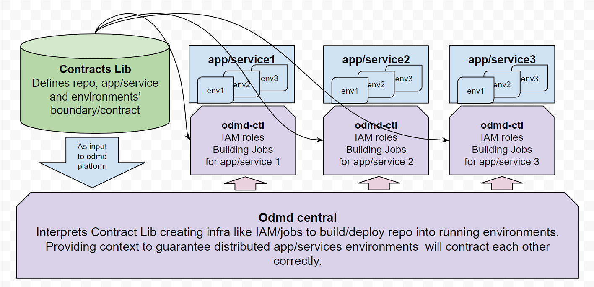
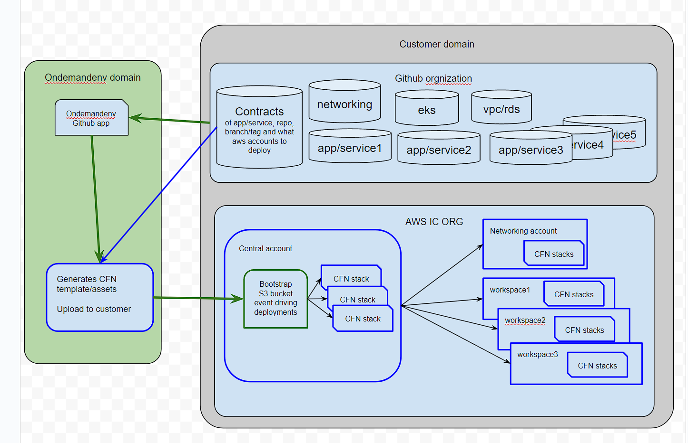
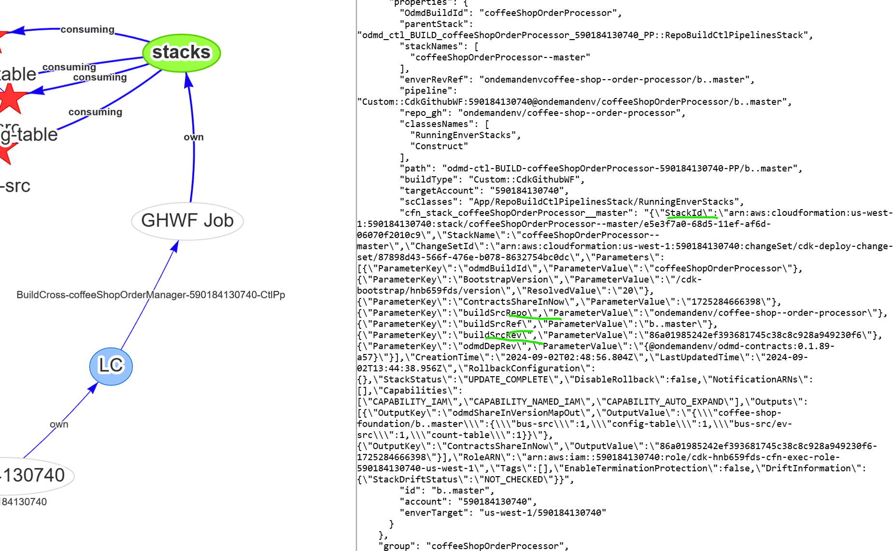
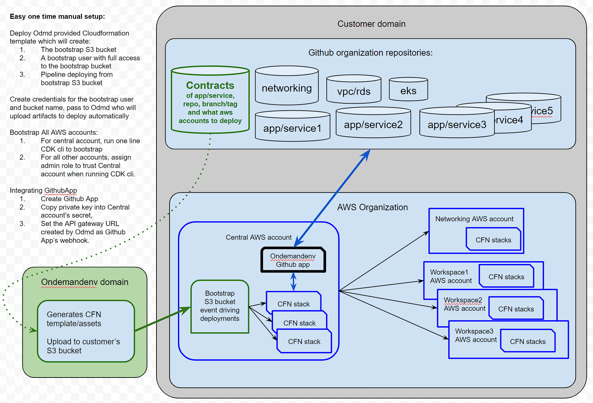
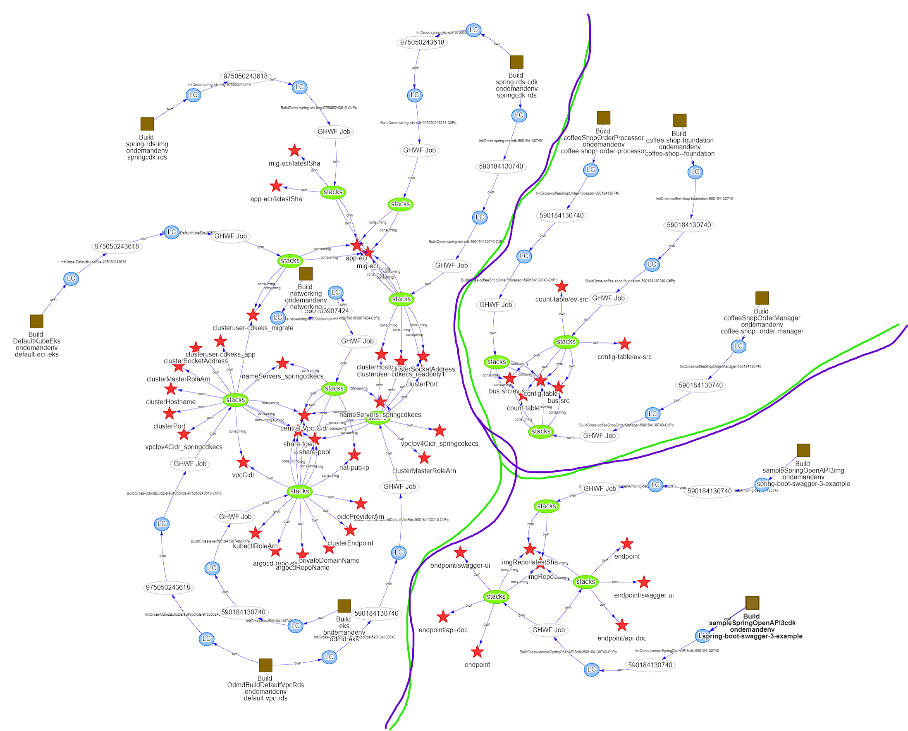
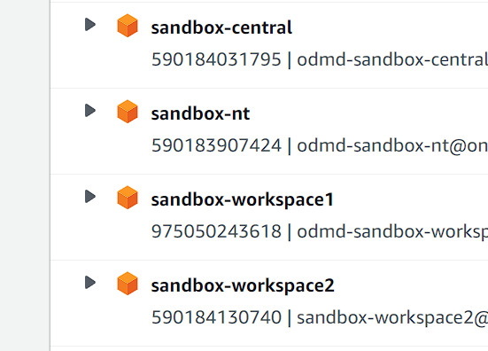
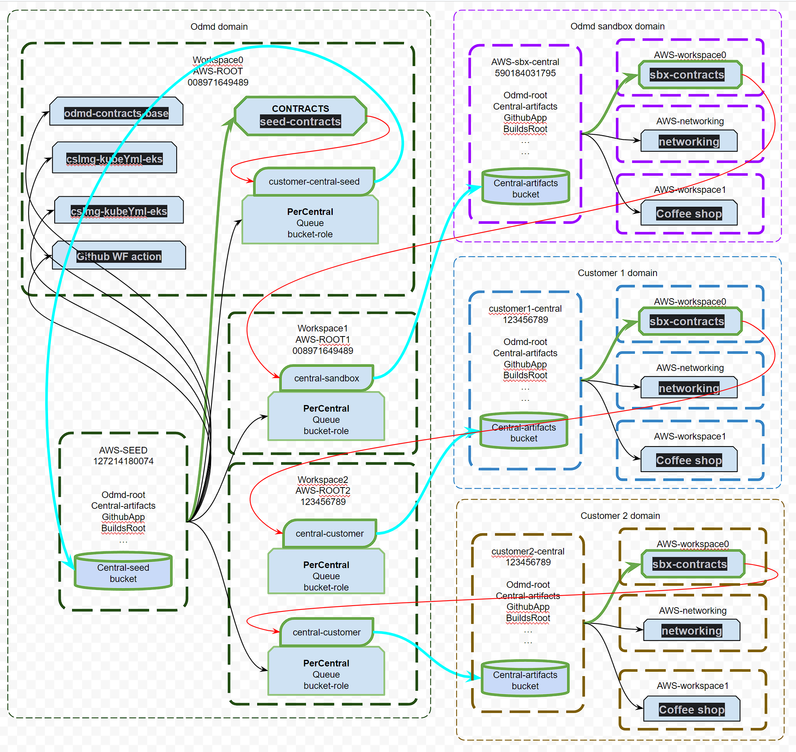

## Challenges & Motivation

In today’s distributed systems, the challenge isn't technology - it's actually maintaining clear boundaries and enabling rapid innovation. I’m building the platform that revolutionizes service-oriented architecture by starting with contracts first, creating focused spaces for both engineers and AI agents to work effectively.

I’ve developed a powerful platform that transforms how teams build and manage distributed systems.
The platform enables developers to instantly create isolated environments for any service with all infrastructure and dependencies.

What sets this apart is my contract-first approach:
services define clear boundaries and interfaces upfront, which the platform uses to manage environments and dependencies automatically.

I have a working prototype with the key capabilities like:
Instant environment provisioning based on service contracts
Automated dependency and configuration management
Full isolation between environments for safe experimentation and testing
Because each service's context and boundaries are clearly defined, both engineers and AI agents can work more effectively within the bounded contexts.
I’m working on context-aware AI agents that understand service boundaries and contracts. I need partners to take over non tech parts of the business and more engineers to perfect the platform.


Distributed systems like SOA/microservice are very difficult to develop, each service can take many parts to work,
services can depend on each other for various reasons, this brings up the problems:

1) Maintain the consistency/certainty inbetween parts of each service is difficult.
    1) Missing assets/image/config
    2) Using wrong configuration version from
        1) code repo
        2) secret store
        3) configuration store
    3) Auth and least privilige V.S. convenience.
2) Maintain the consistency/certainty inbetween services is even more difficult.
    1) beside configuration, service API changing
    2) messaging schema changing
    3) versioning of each service
    4) monitoring and alarming
3) Manual configuration already reached to limit
    1) Can't remember what/how/why/where/when, can easily be hijacked
        1) who/how/why created that repo?
        2) what/how/where/when is the repo deployed last time?
        3) how other services are using/depending on the repo?
    2) Human mistake is inevitable and taking significant effort
        1) one typo can easily take hours for a complex system
        2) too difficult to track every change.
4) Local optimization vs big picture
5) Short term gaining vs long term stratigey
6) GitOps can't handle the complexity, templating yamls are the new binary in cloud era.
    1) Too shallow and rigid to adapt change, simple change can require huge unpractical amount of change of yamls.
    2) Can require multiple commits and multiple deployments across multiple repos for a single change.
    3) Too many repeats in yamls across many files and repos, complexity grows exponentially.
    4) Certain files can easily reach thousands of lines, making it not scalable/sustainable
7) Authentication & Authorization for each service making things difficult.
8) When using AWS CDK code as shell scripts without proper architecting & framework, it stuck ...

## Philosophy & Goals

1) Domain Driven Design to abstract/model the truth from SDLC operational tasks into a platform which:
    1) Managing dependencies among multiple versioned app/services and the platform, also all app/services' SDLC
       lifecycle.
    2) Code generated repeatable & REPLACEABLE & interchangeable environments.
        1) IMMUTABLE for tagging
        2) Incremental for branching
2) Application architecture as actual code to describe services' relationship.
    1) Abstract contracting/interface/boundary of each service, define relationship among in code.
    2) Each service implements its contracting/interface/boundary, generate its deployment manifests/plans.
    3) Monitoring deployments of each environment/version of each service
3) For a distributed systems like SOA/microservice, each service deploys to multiple environment/versions, so that
    1) developers can compare different versions of code/config by comparing different deployed actual running
       environments.
    2) developers can experiment discover and learn.
    3) multiple environments to run more tests in different scenarios in parallel.
4) On demand environment, ultimate flexibility for developers.
    1) By git branching/tagging which event driving automation to create/destroy new version of code/environment.
    2) Monitor/alarm environments' dependency versioning
    3) Environment lifecycle/status sync with github workflow statuses.
5) Monitoring and simulation:
    1) Dynamically generating DAG of dependency
    2) Dynamically generating deployment plans(phase/stages) based on DAG of dependency
    3) Configurable manual verification/approval based on IAM

### High level abstraction of how the platform works:

1) Contracts Lib where define the contracts among services and odmd central
2) Odmd central is the platform creating interpreting contracts and create all contexts for app/services
3) odmd-ctl resources as context for each app service
4) app/services are deployed from source repo into multiple environments.



### High level Abstraction of branch/tag as environment dependency DAG:

The following is a symbolic diagram to show how an app/service consuming endpoints from others, also provides endpoints
for others to consume


### Concrete branch/tag as environment dependency DAG:

This is a running POC web app to visualize how each environments are created and how they contract each other by
producing/consuming each other( red stars )
[Odmd Vis GUI of contracts](https://web.root.ondemandenv.link/)

When selecting node, we can see the stack id and the stack parameter and outputs


### AWS implementation Setup

1) Contracts Lib: https://github.com/ondemandenv/odmd-build-contracts
2) Odmd central: https://github.com/ondemandenv/ONDEMAND_CENTRAL_REPO
3) Odmd-ctl parts of Odmd central.
4) app/services are deployed from source repo into multiple environments across different aws accounts.



1) Above basic set up is good enough to test serverless applications and it is nearly free, less than 2 US dollars a day
   for my debugging.
    2) github app is free for 2000 mins,
    3) AWS is serverless cost is by usage.
2) when setting up Network for VPC across Accounts:
    1) Ipam will cost one US dollar plus traffic.
    2) NAT will cost one US dollar plus traffic.
    3) Transit Gateway will cost one US dollar plus traffic.
4) when setting up eks cluster
    1) eks will have a cost as service
    2) eks instance will cost
    3) Related KMS will cost by usage

After setup of above, we define

3) Define your SOA as code in Contracts Lib:
    1) Created Aws Accounts and Github repos
    2) Github App [create-install-github-app.md](create-install-github-app.md) applicationID and installation ID
    3) Define contracts by extending class
   ```
    export declare abstract class OndemandContracts<A extends AccountsCentralView, G extends GithubReposCentralView, C extends OdmdBuildOdmdContracts<A, G>> extends Construct implements OdmdContractsCentralView<A, G, C> {`
   ```
   filling in AWS accounts, repo org/name, and Github App
   installationID: [create-contracts-lib.md](create-contracts-lib.md) and builds/environments
    4) Publish Contracts Lib to org's package, manually for now, and a token for reading this package
4) Deploy the seeding stack into your central auto account
    1) ask odmd admin to create SQS(odmd-root-branch-per-central) for central-artifact stack
    2) create secret with name:   ghAppPrivateKeySecretName defined in code, paste Github App's private key in
       ```public static readonly ghAppPrivateKeySecretName = 'ghAppPrivateKeySecretName'```
    3) deploy central-artifact stack provided by odmd admin
    3) pass to odmd amind
        1) s3 bucket name
        2) user credentials
        2) contracts lib pkg read only token
    3) Wait central auto initialize and deploy all app/services
       with
       email notification

## Examples:

https://github.com/ondemandenv as Github organization
has [Contracts Lib](https://github.com/ondemandenv/odmd-build-contracts) containing 3 domains of app/services:



### [Springboot deploy to EKS cross VPCs in different accounts](example-springboot-vpc-eks.md)

### [Springboot OpenAPI Running in ECS ](example-springboot-vpc-eks.md)

### [Serverless Step functions need no VPC at all](example-serverless-sfn.md)

deployed into 4 AWS accounts:


working on SAAS for multiple domains:


