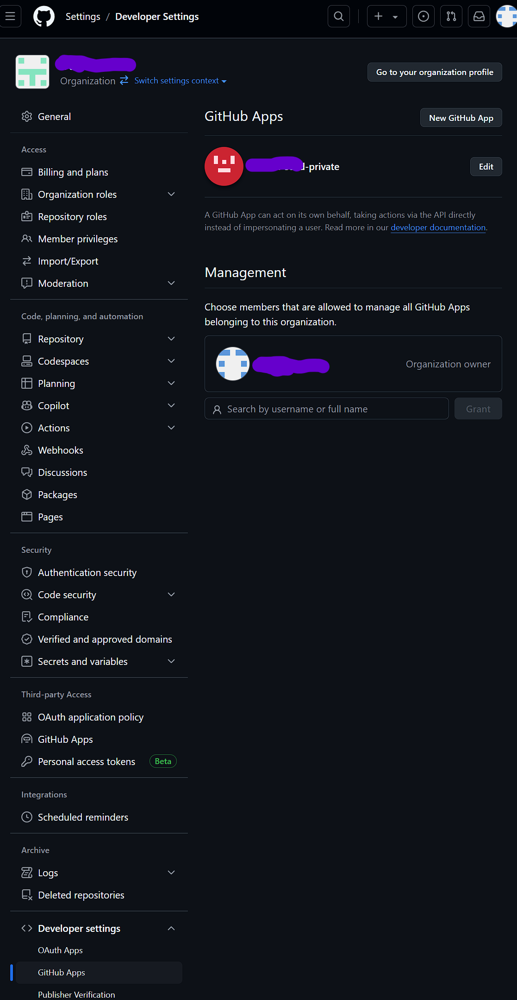
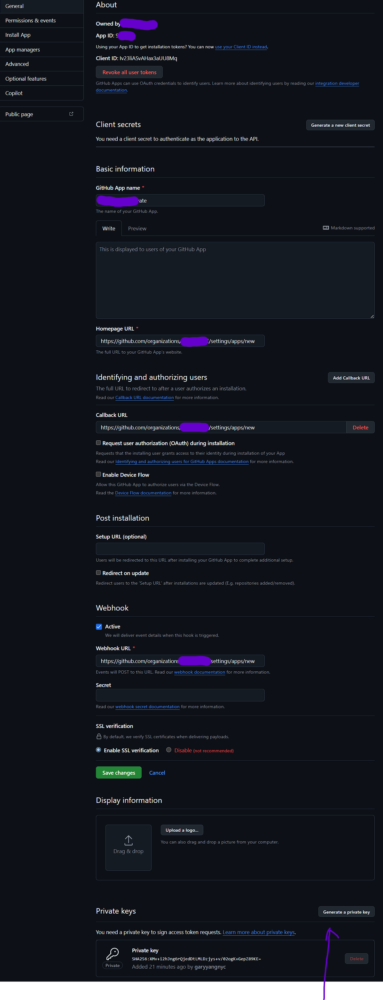
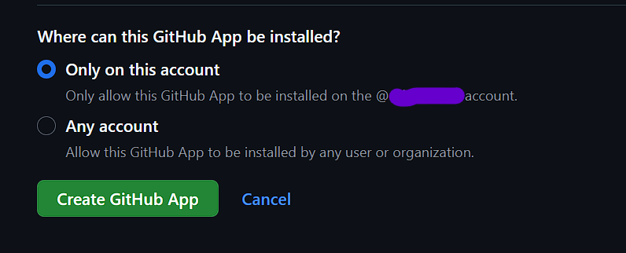
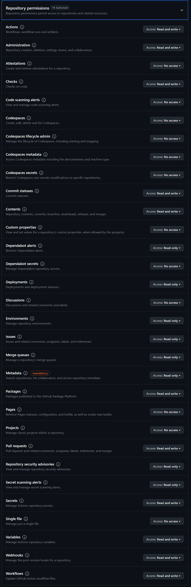
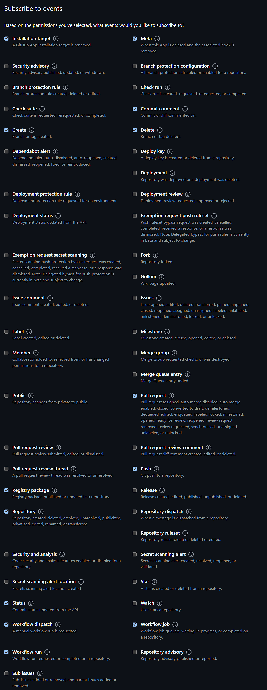
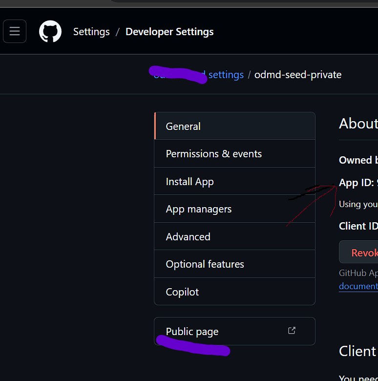

Give it 
a name, 
random Homepage URL for now if not sure
random Callback URL for now if not sure
random Webhook URL for now is not sure

Generate a private key, keep the file secret for later

If only used for same organization:

repo permissions:

No Organization permissions needed
No Account permissions needed

Subscribe to events:

Click on "Public page" to install App
