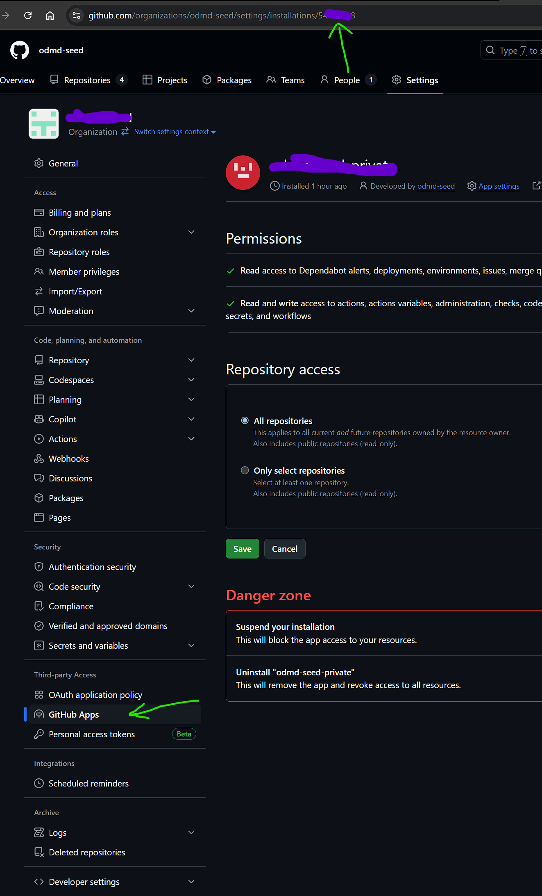

# Creating Github App for Github Organization

Creating Github App needs 1) register Github App; 2) Integrate with ODMD central account

### Register App Navigate thru organization's developer settings:

Give it 
a name, 
random Homepage URL for now if not sure
random Callback URL for now if not sure
random Webhook URL for now is not sure

Generate a private key, keep the file secret for later

Used for same organization in this case/scope

repo permissions:

No Organization permissions needed
No Account permissions needed

Subscribe to events:

Click on "Public page" to install App

Get the installationID and keep it

### Integrate with ODMD central account TBD
